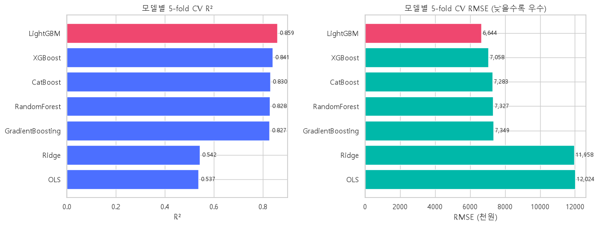
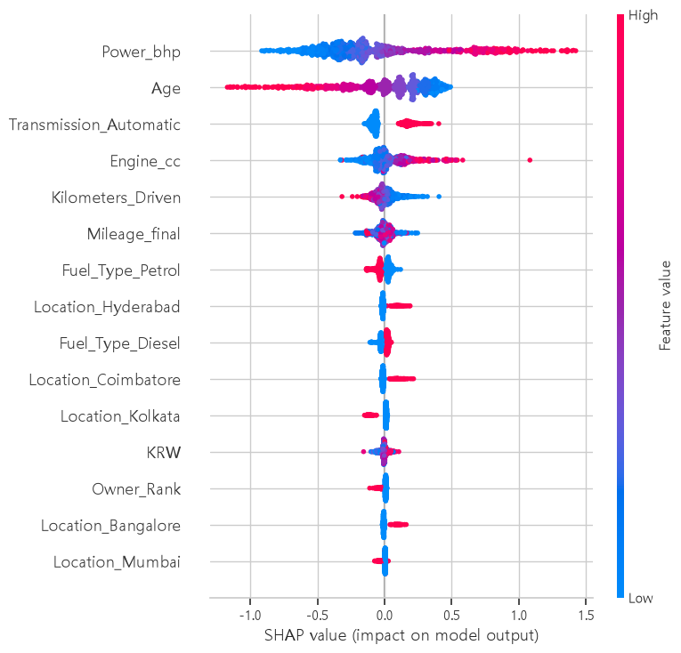
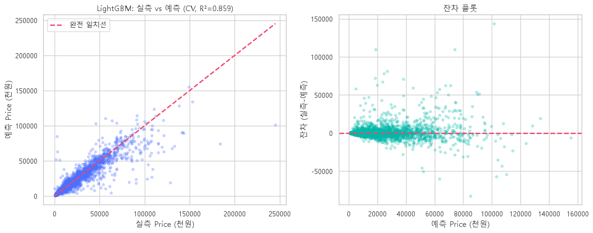
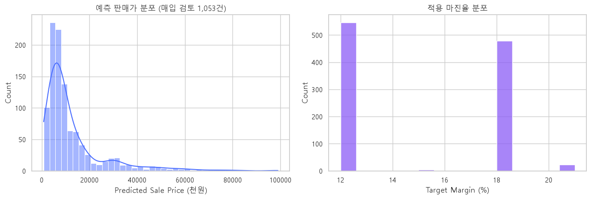
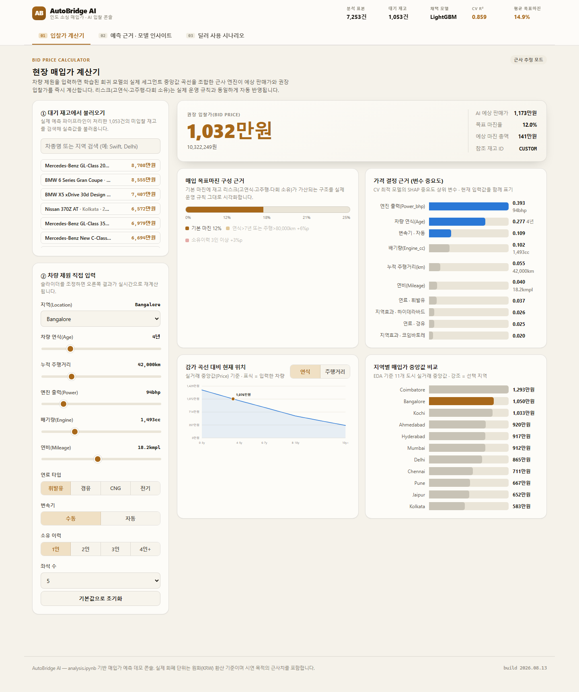

# 🚗 AutoBridge — 인도 중고차 매입가 예측 & 비즈니스 전략 분석

인도 중고차 매입 딜러의 관점에서, 중고차 거래 데이터와 지역별 소득 데이터를 결합해
**적정 매입가(Bid Price)를 자동으로 산정하는 파이프라인**을 만든 데이터 분석 프로젝트입니다.

> **핵심 결과 한눈에 보기**
> - 🎯 OLS·Ridge·RandomForest·GradientBoosting·XGBoost·LightGBM·CatBoost **7개 모델**을 5-fold 교차검증으로 비교해 **LightGBM**(CV **R² = 0.859**, RMSE ≈ 664만원)을 최적 모델로 선정
> - 📉 MAE 기준 평균 판매가 대비 오차율 **약 16.8%** — 소수 초고가 차량이 RMSE를 밀어올리는 것을 감안하면 실사용 수준의 정확도
> - 💰 예측 판매가에 리스크 연동 차등 마진(12~25%)을 적용해 매입가 산정 로직까지 엔드투엔드로 구현하고, 딜러용 웹 콘솔([app/dealer_bid_console.html](app/dealer_bid_console.html))로 시연

- **목표**
  1. 중고차 판매가를 가장 정확히 예측하는 모델 도출
  2. "지역/소득 수준이 가격에 영향을 주는가?"에 대한 통계적 가설 검증
  3. 예측 판매가에 리스크 연동 마진을 적용한 매입가 산정 로직 수립
- **핵심 산출물**: [notebooks/analysis.ipynb](notebooks/analysis.ipynb) 한 파일에 코드 → 실행 결과 → 시각화가 순서대로 담겨 있습니다.

---

## 0. 프로젝트 배경

포스코 빅데이터·AI 아카데미 실습 과제로, "인도 중고차 매입 딜러"라는 페르소나를 맡아
실제 비즈니스 의사결정(얼마에 사들여야 손해를 보지 않는가)에 데이터 사이언스를 적용해보는 것을 목표로 진행했습니다.
단순 가격 예측에서 그치지 않고, ①통계적 가설 검증으로 "왜 그런 가격이 나오는지" 설명하고
②예측 모델을 실제 매입가 산정 로직·웹 콘솔까지 연결하는 엔드투엔드 구성에 초점을 맞췄습니다.

---

## 1. 데이터

`data/` 폴더에 원본 CSV 2개가 있습니다.

| 파일 | 설명 | 규모 |
|---|---|---|
| [Car.csv](data/Car.csv) | 인도 중고차 거래 내역 (차명, 지역, 가격, 연식, 주행거리, 연료타입, 변속기, 소유이력, 연비, 배기량, 마력, 좌석수, 신차가 등) | 7,253행 |
| [지역별소득수준_krw.csv](data/지역별소득수준_krw.csv) | Location·State·Year별 지역 소득 수준 (INR 원화 및 KRW 환산) | 110행, 2011~2020년, 11개 Location / 9개 State |

두 데이터셋은 `Location`(도시) 기준으로 1:1 대응하며, 여기에 `Year`(연식/연도)까지 맞춰 정밀 병합합니다.

---

## 2. 분석 파이프라인 (notebooks/analysis.ipynb)

노트북은 아래 18단계로 구성되어 있습니다.

| 단계 | 내용 |
|---|---|
| 0 | 환경 설정 & 라이브러리 임포트 |
| 1 | 데이터 로드 & 기본 구조/결측치 파악 |
| 2 | 단위 수치 파싱 전처리 — `Mileage`(kmpl/km·kg⁻¹), `Engine`(CC), `Power`(bhp), `New_Price`에서 순수 숫자만 추출. CNG/LPG 연비는 등가환산계수 1.4로 kmpl 단위 통일 |
| 3 | **State·Year 기반 정밀 병합** — 차량 `Year`와 소득 `Year`가 정확히 일치하는 시점의 지역소득을 우선 사용하고, 소득 데이터 범위(2011~2020) 밖 연식은 해당 Location의 최신(2020) 소득값으로 폴백. "순수 소득효과"와 "도시 고유효과"를 분리하기 위해 State 단위 평균소득(`KRW_state_year`)도 별도 산출 |
| 4 | 결측치 임퓨테이션(중앙값) & 파생변수 생성 — `Age`(차령), `Owner_Rank`(소유이력 서열) |
| 5 | 타깃 변수 `Price`의 로그 변환(왜도 완화) |
| 6~10 | EDA — 소득 vs 가격, Location별 가격 분포, 주행거리/연식별 비선형 감가 패턴, 소유이력/연료타입별 가격, 수치형 변수 상관관계 히트맵 |
| 11~12 | 머신러닝 모델링 파이프라인 구성 & **OLS/Ridge/RandomForest/GradientBoosting/XGBoost/LightGBM/CatBoost 7개 모델 5-fold 교차검증 비교** |
| 13 | 최적 모델 진단 — 실측 vs 예측, 잔차 플롯 |
| 14~15 | 변수 중요도 — Permutation Importance, SHAP Summary |
| 16 | **가설 검증** — statsmodels OLS(Robust SE, HC3)로 소득/지역/비선형 감가/소유이력·연비 가설을 통계적으로 검증 |
| 17 | **매입가(Bid Price) 산정 시연** — `Price`가 비어 있는 매입 검토 대상 차량에 최적 모델을 적용해 예측 판매가 산출, 리스크 연동 차등 마진 적용 |
| 18 | 최종 요약 |

### 모델 비교 & 최종 선택

7개 모델을 로그 스케일로 학습 후 원 스케일로 복원해 5-fold 교차검증 R²/RMSE/MAE로 비교했습니다.



| 모델 | R² | RMSE(천원) | MAE(천원) |
|---|---|---|---|
| **LightGBM** ⭐ | **0.859** | **6,644** | **2,503** |
| XGBoost | 0.841 | 7,058 | 2,595 |
| CatBoost | 0.830 | 7,283 | 2,819 |
| RandomForest | 0.828 | 7,327 | 2,765 |
| GradientBoosting | 0.827 | 7,349 | 2,980 |
| Ridge | 0.542 | 11,958 | 4,139 |
| OLS | 0.537 | 12,024 | 4,107 |

**LightGBM**이 최적 모델로 선정되었습니다. 전체 데이터의 Price 평균은 14,913천원, 중앙값은 8,815천원(비율 1.69로 우측 왜도가 큰 분포)인데,
이 기준으로 오차를 상대화하면 **MAE/평균 판매가 ≈ 16.8%**, RMSE/평균 판매가 ≈ 44.6%입니다.
RMSE 기준 비율이 크게 보이는 것은 소수의 초고가 차량이 제곱오차를 크게 밀어올리기 때문이며,
체감 오차(대부분의 거래에서 실제로 벌어지는 오차)는 **MAE 기준 약 17% 내외**로 보는 것이 더 정확합니다.

변수 중요도(Permutation·SHAP 공통) 상위는 `Power_bhp`, `Age`, `Engine_cc` 순입니다.





### 주요 가설 검증 결과

| 가설 | 결과 |
|---|---|
| H1. 지역 소득 수준이 가격에 영향을 준다 | 통계적으로는 유의하나 부호가 반대이고 효과 크기가 미미 → 경제적 유의성은 낮음 |
| H2. 지역(Location) 고유 효과가 있다 | **강하게 채택** (p≈10⁻⁸⁰) — 도시 간 가격 격차를 압도적으로 설명 |
| H3. 감가는 비선형이다 | 주행거리는 8만km 기준 하락률이 둔화(부분 채택), 연식은 10년 이상에서 오히려 하락률 가속(가설과 반대) |
| H4. 소유이력·연비가 가격에 영향을 준다 | 1인소유 프리미엄은 확인(채택), 연비 자체의 순수 프리미엄은 미확인 |

> **H1이 이런 결과가 나온 이유**: 회귀식에는 소득(`KRW_state_year`)과 Location 더미를 함께 넣었는데,
> 같은 도시의 차량들은 소득값이 거의 동일하다 보니(도시 단위로 소득이 결정되므로) 두 변수가 사실상
> 같은 정보를 나눠 갖는 **다중공선성** 상태가 됩니다. Location 더미가 "그 도시가 원래 비싼 이유"를
> 이미 다 흡수해버려서, 소득 변수에는 설명할 몫이 거의 남지 않고 부호도 불안정해진 것으로 해석됩니다.
> → 실무적으로는 "소득"보다 **"어느 도시인가"** 자체를 매입가 조정 축으로 쓰는 것이 더 안정적입니다.

### 매입가 산정 로직

```
Predicted_Sale_Price = exp(LightGBM 예측값)          # 로그 스케일 → 원 스케일 복원
Target_Margin        = 기본 12%
                        + (연식 7년 초과 또는 주행거리 8만km 초과 시 +6%p)
                        + (소유이력 3회 이상 시 +3%p)
                        상한 25%
Bid_Price             = Predicted_Sale_Price × (1 − Target_Margin)
```



⚠️ 예측가는 시장 추정치이며, 실제 매입 시 **사고 이력·외관/기계 상태의 현장 실사**가 반드시 병행되어야 합니다.

---

## 3. 딜러용 웹 콘솔 (app/dealer_bid_console.html)

분석 결과(예측 모델·SHAP 중요도·지역별 시세·매입가 로직)를 실무자가 바로 쓸 수 있는 형태로 옮긴 **정적 웹 대시보드**입니다.
서버 없이 브라우저에서 파일만 열면 동작하며, 매입 검토 대상 1,053건의 예측 결과가 내부에 내장되어 있어
차량을 검색하거나 제원 슬라이더를 조정하면 권장 입찰가가 즉시 계산됩니다.



**실행 방법**: `app/dealer_bid_console.html` 파일을 더블클릭하거나 브라우저에 끌어다 놓으면 바로 열립니다(별도 서버·설치 불필요).

- **① 입찰가 계산기**: 대기 재고에서 차량을 검색하거나 지역·연식·주행거리·엔진 스펙을 직접 입력 → 예상 판매가·목표 마진·권장 입찰가 실시간 계산
- **② 예측 근거·모델 인사이트**: 변수 중요도(SHAP), 감가 곡선, 지역별 매입가 중앙값 비교
- **③ 딜러 사용 시나리오**: 실제 매입 현장에서의 활용 흐름 안내

---

## 4. 폴더 구조

역할별로 폴더를 나눴습니다. (`catboost_info/`는 노트북/스크립트를 실행할 때마다 자동으로 생기는 학습 로그라 저장소에는 올리지 않습니다 — `.gitignore` 처리)

```
AutoBridge/
├── data/                            # 원본 데이터
│   ├── Car.csv                      # 중고차 거래 원본 데이터
│   └── 지역별소득수준_krw.csv         # 지역별 소득 원본 데이터
├── notebooks/
│   └── analysis.ipynb                # 🌟 메인 분석 노트북 (코드+결과+시각화)
├── scripts/                          # 재현/빌드용 스크립트
│   ├── analysis2.py                  # analysis.ipynb와 동일한 분석의 .py(CLI) 버전
│   ├── build_notebook.py             # notebooks/analysis.ipynb를 코드로 생성하는 빌더
│   ├── build_report_html.py          # report/의 그림으로 report/report.html을 조립하는 스크립트
│   └── export_merged_data.py         # 전처리·병합 단계(§1~4)만 재현해 outputs/merged_preprocessed.csv를 생성 (모델 학습 없이 수 초 내 완료)
├── report/
│   ├── report.html                   # 비전공자용 분석 결과 요약 보고서
│   └── figures/                      # 보고서에 쓰인 그림 16장 + manifest.json
├── app/
│   ├── dealer_bid_console.html       # 매입가 산정 결과를 보여주는 딜러용 웹 콘솔(프로토타입)
│   └── screenshot.png                # 위 콘솔의 화면 캡처
├── outputs/
│   ├── bid_price_predictions.csv     # 17단계 실행 결과물 — 매입 검토 대상 차량별 예측가/마진/매입가
│   └── merged_preprocessed.csv       # 전처리·병합이 끝난 전체 데이터셋(7,253행) — 모델링용/매입대상 구분(data_split) 포함
└── requirements.txt                  # 분석 실행에 필요한 패키지 목록
```

---

## 5. 실행 방법

- **개발/검증 환경**: Python 3.14 (`requirements.txt`가 numpy>=2.5, pandas>=3.0 등 최신 버전을 요구하므로 비교적 최근 Python 버전이 필요합니다)
- 전체 노트북을 처음부터 끝까지 재실행하면 데이터 규모(7,253행) 자체는 크지 않지만, **7개 모델 5-fold 교차검증 + SHAP 계산** 구간에서 시간이 가장 많이 걸립니다. 일반적인 노트북 CPU 기준 대략 수 분(3~5분) 내외를 예상하되, 하드웨어·CatBoost/LightGBM 빌드 환경에 따라 달라질 수 있습니다. 이미 실행된 결과·그래프는 `notebooks/analysis.ipynb`에 그대로 저장되어 있어, 재실행 없이 열어보기만 해도 전체 과정을 확인할 수 있습니다.

```bash
pip install -r requirements.txt
jupyter notebook notebooks/analysis.ipynb
```

노트북을 처음부터 끝까지 실행하면 `data/` 폴더의 두 CSV를 읽어 전 과정을 재현하고,
마지막 단계에서 `outputs/bid_price_predictions.csv`를 다시 생성합니다.
(Jupyter를 프로젝트 루트에서 열든 `notebooks/` 폴더에서 열든 자동으로 `data/`·`outputs/` 경로를 찾아갑니다.)

`scripts/`의 빌더 스크립트는 프로젝트 루트에서 실행하는 것을 기준으로 합니다.

```bash
python scripts/build_notebook.py       # notebooks/analysis.ipynb를 처음부터 다시 생성
python scripts/build_report_html.py    # report/figures를 읽어 report/report.html을 재생성
python scripts/analysis2.py            # 노트북과 동일한 분석을 커맨드라인에서 실행 (수 분 내외)
python scripts/export_merged_data.py   # 전처리·병합 결과만 outputs/merged_preprocessed.csv로 저장 (모델 학습 없이 수 초)
```

---

## 6. 한계 및 주의사항

- 소득 데이터가 없는 연식(주로 2011년 이전)은 해당 Location의 2020년 최신 소득값으로 대체(폴백)한 값입니다.
- 매입가는 통계적 예측치이며, 사고/침수 이력 등 데이터에 없는 리스크는 반영되어 있지 않습니다.
- 연식 기준 비선형 감가(가설3)는 생존편향(survivorship bias) 가능성이 있어 해석에 주의가 필요합니다.
- RMSE가 MAE보다 훨씬 큰 것에서 보이듯, 초고가 차량 구간은 상대적으로 예측 오차가 큽니다. 고가 차량 매입 시에는 모델 예측치를 더 보수적으로 참고해야 합니다.

---

## 7. 라이선스

이 프로젝트는 [MIT License](LICENSE)를 따릅니다.

---

## 8. 데이터 출처
### Car.csv
- 포스코 빅데이터·AI 아카데미 제공
### 지역별소득수준_krw.csv
- 데이터 출처: Reserve Bank of India, Database on Indian Economy (DBIE)
- 원자료명: Table 19 - Per Capita Net State Domestic Product (Current Prices), Base: 2011-12
- 수집 범위: 2011-12 ~ 2019-20 회계연도, 인도 9개 주
- 단위 변환: 원자료(INR) → 원화(KRW) 환산, 적용 환율 1 INR = 15 KRW
- 접속 URL: https://data.rbi.org.in/#/dbie/home
- 최종 접속일: 2026년 8월 12일

---

## 9. Team (7)
김연희, 강인수, 박승형, 박지훈, 양진후, 이선희 , 임성민

